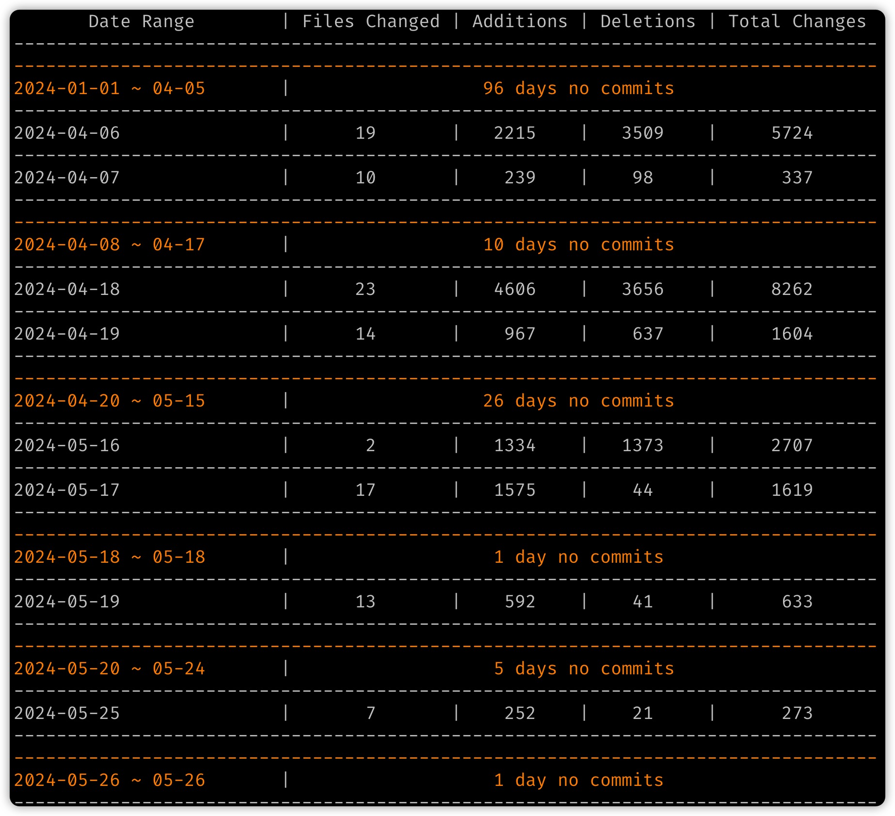

# git-stat

A small utility tool to show stats of a git repo.

## How to install?

Run this command in your shell:

```bash
go install github.com/daqing/git-stat@latest
```

## Example Output




## License

MIT

